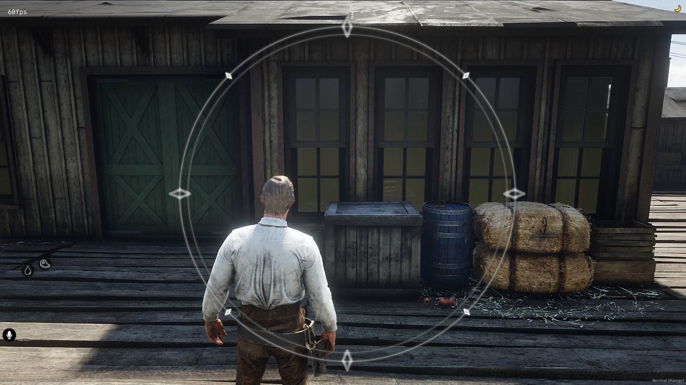

# DESCRIPTION
Simple Standalone RedM Anti-Motion Sickness Overlay. Created for use in VORP, however will run in any framework.\
Created for my wife who suffers from Motion Sickness in-game, with an attempt to allow her to continue playing a game she enjoys and to get back in to RP.

# USAGE
Use /ams or /motionsick to toggle the overlay on/off.

# CREDITS
1. Blizzard (World of Warcraft) for the Anti-Motion Sickness circle idea - recreated it myself with the same layout, as it works.
2. My wife, for giving me the idea of creating the script for it, based on the above as it works for her in WoW.

# INSTALLATION
1. Add to your [Standalone] folder.
2. Add 'ensure daek_ams' to your server.cfg
3. ???
4. Profit (*no more motion sickness, hopefully!*)